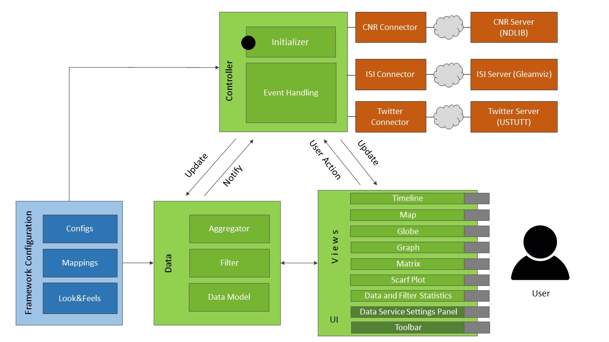

# VisFramework Documentation

Documentation for the visFramework JavaScript visualization framework.

For information on how to set up and run the framwork see [README.md](../README.md).

## Table of Contents

1. [VisFramework Documentation](#visframework-documentation)
    1. [Table of Contents](#table-of-contents)
    2. [Configuration](#configuration)
        1. [Default Configuration](#default-configuration)
        2. [Custom Configurations](#custom-configurations)
        3. [View Configurations](#view-configurations)
    3. [Architecture](#architecture)
        1. [Overview](#overview)
        2. [Configuration File](#configuration-file)
        3. [Controller](#controller)
        4. [Connectors](#connectors)
        5. [Data](#data)
            1. [Model](#model)
            2. [Filter](#filter)
            3. [Aggregator](#aggregator)
            4. [Community Detection](#community-detection)
        6. [Visual Mapping Functions](#visual-mapping-functions)
        7. [Views](#views)
    4. [Libraries](#libraries)
        1. [External](#external)
        2. [Internal](#internal)
    5. [Build System](#build-system)
    6. [Future Work](#future-work)

## Configuration

The client configuration is stored in [config/config.js](../config/config.js). Depending on device type, display size and anticipated user expertise, different configuations may offer advantages over others.

The VisFramework automatically recognizes mobile devices and loads the respective configuration, but users may also change it via buttons.

### Default Configuration

`Config()` is a constructor that takes an ID and description object and returns a configuration object with default values.

```javascript
class Config {
    constructor(id, description) {
        // unique ID
        this.id = id;
        // general description and attributes
        this.description = description;
        // general interface
        this.UI = {
            // title may contain HTML
            title: "Cimplex Visualization",
            ...
        };
        // filter configuration
        this.filter = {
            ....
        };
        // views' configurations
        this.timeline = {

        };
        ...
    }
}
```

### Custom Configurations

You can create custom configurations by using this constructor and then overwriting only the specific attributes you want to change:

```javascript
config.mobile = new Config("mobile", {
    name: "mobile phone configuration",
    expertise: "novice",
    device: "mobile",
    devicePerformance: "low"
});
config.mobile.UI.viewColumns = [12, 12, 12, 12];
config.mobile.UI.viewRows = 2;
config.mobile.UI.viewLimit = 2;
config.mobile.UI.viewDragAndDrop = false;
...
```

### View Configurations

Views may have their own configuration inside the `Config()` constructor:

```javascript
this.graph = {
    edgeBundling: false,
    showLabels: true,
    labelLimit: 20,
    showCommunities: true,
    // directed links may be shown as undirected to reduce clutter
    linkDirection: true,
    // direction of links can be indicated via "doubleLines", "halfArrows" or "curvature"
    linkDirectionIndicator: "doubleLines",
    ...
};
```

Users may change some of those attributes via buttons in the view’s title bar or settings panel.

## Architecture

The following subsections explain the basic structure of the VisFramework.

### Overview

[Figure 1](#architectureDiagram) shows an architecture diagram. The orange parts, i.e. services and respective connectors, have to be implemented by data service providers.

Administrators may change the Framework Configuration (blue) and third party developers may implement custom view modules.

The user interacts with the framework through the toolbar and the views.


*Figure 1* The VisFramework’s architecture. <a name="architectureDiagram"></a>

### Configuration File

See the [configuration section](#configuration) above.

### Controller

The controller ([/controller/](../controller/)) initializes the framework UI and event management.

### Connectors

Connectors provide an interface between the VisFramework’s data model and online data services. Static data may be directly included in a connector's directory.

We implemented the class [connectorType](../types/_connectorType.js) in order to simplify the creation of custom connectors. The file [types/_connectorTypeExample.js](../types/_connectorTypeExample.js) shows how to use this class.

Refer to the readme files in each connector's directory for detailed information.

### Data

The [dataModel/](../dataModel/) directory contains all data management files. They are explained in the following subsections.

#### Model

The [model.js file](../dataModel/model.js) contains a list of regions, a list of transitions and a number of general data properties, e.g. the total timespan of the data.

#### Filter

The filter is implemented in [filter.js](../dataModel/filter.js) and stores filered results in [filteredData.js](../dataModel/filteredData.js) objects.

Views can offer brushing or selection interactions and then use the filter events to apply certain filters to the data. Currently we support filtering on a time span, reactangular geographic area, specific regions and a single community.

#### Aggregator

The file [aggregator.js](../dataModel/aggregator.js) contains function for time dependent aggregation of transitions.

#### Community Detection

The file [community.js](../dataModel/community.js) implements jLouvain community detection.

### Visual Mapping Functions

The visual mappings from data values to colors, sizes, etc. has to be provided by the connectors. They are then cached in [config/mapping.js](../config/mapping.js) and can be accessed by views using the global MAPPING object.

### Views

You can create views by extending the ViewType class. The file [types/_viewTypeExample.js](../types/_viewTypeExample.js) contains example code for this task. Views have access to the data and to mappings (see above). ViewType takes care of window management entirely.

Views have complete freedom in how they display their content, they may use HTML, Canvas, SVG, WebGL, etc. Canvas and WebGL are prefered for many shown items due to performance issues caused by having many DOM elements.

## Libraries

The VisFRamework uses external and internal libraries that are listed below.

### External

The table below lists all used external libraries and their respective uses.

| Name                                                         | Used for                                                      | License \*                                                                                         |
| ------------------------------------------------------------ | ------------------------------------------------------------- | -------------------------------------------------------------------------------------------------- |
| [Bootstrap](http://getbootstrap.com/)                        | general page layout                                           | [MIT License](https://github.com/twbs/bootstrap/blob/master/LICENSE)                               |
| [Colorbrewer](http://colorbrewer2.org/)                      | color palettes that are used in color mapping                 | [Apache License 2.0](https://github.com/axismaps/colorbrewer/blob/master/LICENCE.txt)              |
| [Crossfilter](https://github.com/crossfilter/crossfilter/)   | data filtering                                                | [Apache License 2.0](https://github.com/crossfilter/crossfilter/blob/master/LICENSE)               |
| [d3 v3](https://d3js.org/)                                   | utility functions, scaling, interaction, colors and timeline. | [BSD 3-clause "New" or "Revised" License](https://github.com/d3/d3/blob/master/LICENSE)            |
| [d3 v4](https://d3js.org/)                                   | updated packages for some functionality                       | [BSD 3-clause "New" or "Revised" License](https://github.com/d3/d3/blob/master/LICENSE)            |
| [d3forcebundle](https://github.com/upphiminn/d3.ForceBundle) | force directed edge bundling with d3                          | [GNU General Public License v2.0](https://github.com/upphiminn/d3.ForceBundle/blob/master/LICENSE) |
| [Font Awesome](http://fontawesome.io/)                       | icons                                                         | [SIL OFL 1.1 (font), MIT License (code)](http://fontawesome.io/license/)                           |
| [gLayers](https://github.com/Sumbera/gLayers.Leaflet)        | canvas Layer for Leaflet                                      | [MIT License](https://github.com/Sumbera/gLayers.Leaflet/blob/master/LICENSE.TXT)                  |
| [jLouvain](https://github.com/upphiminn/jLouvain)            | community detection                                           | [MIT License](https://github.com/upphiminn/jLouvain/blob/master/LICENSE)                           |
| [jQuery](https://jquery.com/)                                | HTTP requests and DOM manipulation                            | [MIT License](https://jquery.org/license/)                                                         |
| [Leaflet](https://github.com/Leaflet/Leaflet)                | geographic map                                                | [BSD 2-clause "Simplified" License](https://github.com/Leaflet/Leaflet/blob/master/LICENSE)        |
| [Mustache](https://github.com/mustache/mustache.github.com)  | HTML logic-less templates                                     | [MIT License](https://github.com/mustache/mustache.github.com/blob/master/LICENSE.md)              |
| [Sortable](https://github.com/RubaXa/Sortable)               | view drag and drop to reorder views                           | [MIT License](https://github.com/RubaXa/Sortable)                                                  |
| [inflection.js](https://code.google.com/p/inflection-js/)    | word inflection                                               | [MIT License](https://code.google.com/archive/p/inflection-js/)                                    |

\* *as of 2018-01-22*

### Internal

The table below lists our own libraries and their respective uses.

| Name               | Used for                                                                                |
| ------------------ | --------------------------------------------------------------------------------------- |
| vectorSimilarity   | contains functions which compare vectors in order to be able to sort them by similarity |
| WebWorkerPool      | controls the creation of webworker threads                                              |
| edgeBundlingWorker | calculates the force directed edge bundling in a separate thread                        |
| dfkiDecoder        | decodes data from DFKI data services                                                    |
| lib.js             | utility functions                                                                       |
| ui.js              | UI functions                                                                            |

## Build System

The build system automatically minimizes and concatenates all JavaScript code in order to maximize page load performance.

It is based on [Node.js](https://nodejs.org/en/) and executed via the following commands:

```bash
npm install
npm run build:development
```

or, for building a minified version

```bash
npm install
npm run build:production
```

Any new JavaScript files need to be added to [scripts/build.js](../scripts/build.js).

# Future Work

- Additional connectors for various data sources
- Additional visualization views
- Support for multiple datasets shown next to each other
